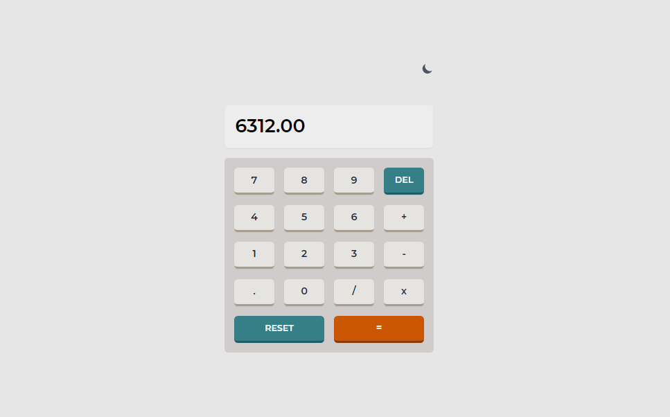

# Calculator app project

### Overview
This is a basic  responsive calculator app  where users can perform mathematical operations like addition, subtraction, multiplication, and division with added functionality of light & dark theme.

### Screenshot

### Links
- Live Site URL: [On Netlify](https://calculator-dm.netlify.app/)

## My process

### Built with
- Semantic HTML5 markup
- CSS custom properties
- Flexbox
- CSS Grid
- [Tailwindcss](https://tailwindcss.com/) - CSS library
- [React](https://reactjs.org/) - JS library

## Acknowledgments
Thanks to [Frontend Mentor](https://www.frontendmentor.io) as I was inspired by their calculator design.
